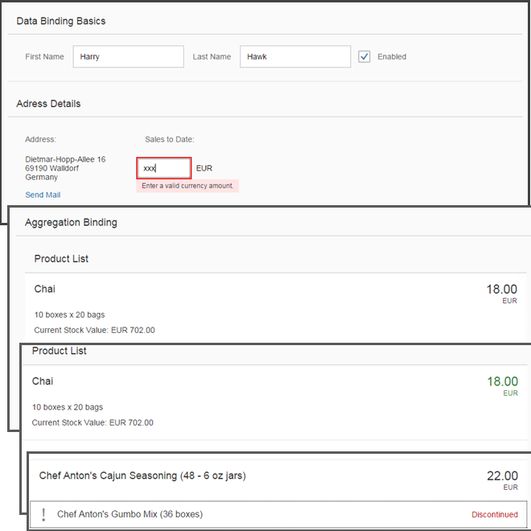

# UI5-Data-Binding

This repository is meant to serve as example for how data binding works within UI5. It is basically what happens when you work through the entire "Data-Binding"-Section within the official [UI5 documentation](https://sapui5.hana.ondemand.com/#/topic/e5310932a71f42daa41f3a6143efca9c).

### Overview


### Preview



# Getting Started

You can just clone this repository, run npm install and use the [UI5 tooling](https://github.com/SAP/ui5-tooling) to locally serve the application in order to debug/learn from it.

Hint: it already uses the livereload-middleware for the [UI5 tooling](https://github.com/SAP/ui5-tooling), so changes while serving will trigger an immediate update in the browser.

1. Clone the repository
    ```sh
    git clone <repository-url>
    ```
1. Navigate into the cloned repository 
    ```sh
    cd <repository>
    ```
1. Install all dependencies
    ```sh
    npm install
    ```
1. Start the application
    ```sh
    npm start
    ```
## Namespace & Projectname

The paths within this project are - as usual - prefixed by the `projectId` ( which is declared within the `manifest.json` file). The prefix is made up by a given namespace and the name of the project. I must admit that the project name is quite verbose.

* Namespace: `com.mrb`
* Projectname: `UI5-Data-Binding`


# Tutorial Steps

* Step 1: No Data Binding :white_check_mark: [3e3bee0](https://github.com/SAPMarco/UI5-data-binding/commit/3e3bee0cdea2f37210a994014912f3574f40a918)
* Step 2: Create a Model :white_check_mark: [24e6a13](https://github.com/SAPMarco/UI5-data-binding/commit/24e6a13b822b1d2c3a836fcb8ce4e181752da2bd)
* Step 3: Create Property Binding :white_check_mark: [79ea293](https://github.com/SAPMarco/UI5-data-binding/commit/79ea2937a7b2d40937c1358f7c7a77b5a47a2103)
* Step 4: Two-Way Binding :white_check_mark: [4514324](https://github.com/SAPMarco/UI5-data-binding/commit/4514324a58abf1622e5833329e886814f1d2b78e)
* Step 5: One-Way Binding :white_check_mark: [cb37402](https://github.com/SAPMarco/UI5-data-binding/commit/cb37402fb19de5576590ccbcc70abf1d5a858a4c)
* Step 6: Resource Models :white_check_mark: [7fe1738](https://github.com/SAPMarco/UI5-data-binding/commit/7fe1738b4a6685a7226ecd438d4cec364c084783)
* Step 7: Resource Bundles and Multiple Languages :white_check_mark: [27418b9](https://github.com/SAPMarco/UI5-data-binding/commit/27418b99d57dc3253afdf871ffd2889a5055fee6)
  * Addition: Reverted Step 6 & 7 as the Resource Model is handled in manifest.json nowadays :white_check_mark: [e4e3f1e](https://github.com/SAPMarco/UI5-data-binding/commit/e4e3f1ebcf5452258f0c7d7ba5fc20a6fa128d40)
* Step 8: Binding Paths - Accessing Properties in Hierarchically Structured Models :white_check_mark: [554f7ad](https://github.com/SAPMarco/UI5-data-binding/commit/554f7ad93b488ce5ee3e52c879cd8c462e0228d0)
* Step 9: Formatting Values :white_check_mark: [d077849](https://github.com/SAPMarco/UI5-data-binding/commit/d07784944a58fecbce62b8f45177e4871110e547)
* Step 10: Property Formatting Using Data Types :white_check_mark: [d0a74fd](https://github.com/SAPMarco/UI5-data-binding/commit/d0a74fd83d67e5055b137b198b3dde37288a2fe3) 
* Step 11: Validation Using the Message Manager :white_check_mark: [c1537fa](https://github.com/SAPMarco/UI5-data-binding/commit/c1537faac51972faa2356fa0c27828a4de7e921f) 
* Step 12: Aggregation Binding Using Templates :white_check_mark: [c54bfd7](https://github.com/SAPMarco/UI5-data-binding/commit/c54bfd7d8c7d3bcee2ea54c528338297a7746efb)
* Step 13: Element Binding :white_check_mark: [ff5114c](https://github.com/SAPMarco/UI5-data-binding/commit/ff5114c100ac587ef9bae4cde9ca8ede74d25fa0)
* Step 14: Expression Binding :white_check_mark: [eb30253](https://github.com/SAPMarco/UI5-data-binding/commit/eb30253fb2d673da0de69ae06dbae7f7bb0b6292) 
* Step 15: Aggregation Binding Using a Factory Function :white_check_mark: [3b8f0b0](https://github.com/SAPMarco/UI5-data-binding/commit/3b8f0b057b3e4cc91467248e1ac7e25fea2b1edf) 

Implemented = :white_check_mark:

# Credits

* [Wiki - Binding Syntax](https://github.com/SAPMarco/SAPMarco.github.io/wiki/UI5-Binding-Syntax)
* [UI5 Documentation](https://sapui5.hana.ondemand.com/#/topic/68b9644a253741e8a4b9e4279a35c247)
* [UI5 Walkthrough](https://sapui5.hana.ondemand.com/#/topic/e5310932a71f42daa41f3a6143efca9c)
* [Getting Started](https://sapui5.hana.ondemand.com/#/topic/8b49fc198bf04b2d9800fc37fecbb218.html)
* [Each Step as Download](https://sapui5.hana.ondemand.com/#/entity/sap.ui.core.tutorial.databinding)
* [Aggregation Binding + Factory](https://sapui5.hana.ondemand.com/#/topic/284a036c8ff943238fb65bf5a2676fb7)
* [Message Manager](https://sapui5.hana.ondemand.com/#/topic/b8c4e534cdb440e9a5bbff86f9572bd6)
* [Messages in UI5](https://sapui5.hana.ondemand.com/#/topic/62b1481d3e084cb49dd30956d183c6a0.html)
* [Project Scaffolding with EasyUI5](https://github.com/SAP/generator-easy-ui5)