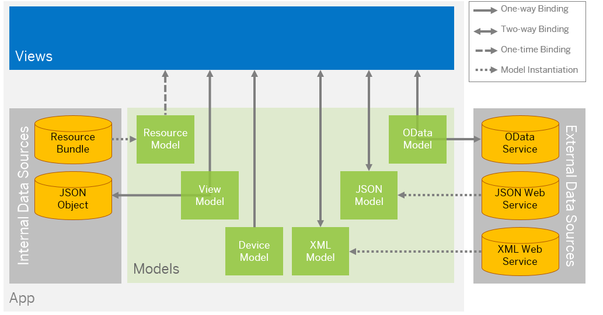

# UI5-Data-Binding

This repository is meant to serve as example for how data binding works within UI5. It is basically what happens when you work through the entire "Data-Binding"-Section within the official [UI5 documentation](https://sapui5.hana.ondemand.com/#/topic/e5310932a71f42daa41f3a6143efca9c).

### Preview


### Overview



# Getting Started

You can just clone this repository, run npm install and use the [UI5 tooling](https://github.com/SAP/ui5-tooling) to locally serve the application in order to debug/learn from it.

Hint: it already uses the livereload-middleware for the [UI5 tooling](https://github.com/SAP/ui5-tooling), so changes while serving will trigger an immediate update in the browser.

1. Clone the repository
    ```sh
    git clone <repository-url>
    ```
1. Navigate into the cloned repository 
    ```sh
    cd <repository>
    ```
1. Install all dependencies
    ```sh
    npm install
    ```
1. Start the application
    ```sh
    npm start
    ```
## Namespace & Projectname

The paths within this project are - as usual - prefixed by the `projectId` ( which is declared within the `manifest.json` file). The prefix is made up by a given namespace and the name of the project. I must admit that the project name is quite verbose.

* Namespace: `com.mrb`
* Projectname: `UI5-Data-Binding`


# Tutorial Steps

* Step 1: No Data Binding :white_check_mark: [3e3bee0](https://github.com/SAPMarco/UI5-data-binding/commit/3e3bee0cdea2f37210a994014912f3574f40a918)
* Step 2: Create a Model
* Step 3: Create Property Binding
* Step 4: Two-Way Binding
* Step 5: One-Way Binding
* Step 6: Resource Models
* Step 7: Resource Bundles and Multiple Languages
* Step 8: Binding Paths - Accessing Properties in Hierarchically Structured Models
* Step 9: Formatting Values
* Step 10: Property Formatting Using Data Types
* Step 11: Validation Using the Message Manager
* Step 12: Aggregation Binding Using Templates
* Step 13: Element Binding
* Step 14: Expression Binding
* Step 15: Aggregation Binding Using a Factory Function

Implemented = :white_check_mark:

# Credits

For more information check:

* [UI5 Documentation](https://sapui5.hana.ondemand.com/#/topic/68b9644a253741e8a4b9e4279a35c247)
* [UI5 Walkthrough](https://sapui5.hana.ondemand.com/#/topic/e5310932a71f42daa41f3a6143efca9c)
* [Getting Started](https://sapui5.hana.ondemand.com/#/topic/8b49fc198bf04b2d9800fc37fecbb218.html)
* [Each Step as Download](https://sapui5.hana.ondemand.com/#/entity/sap.ui.core.tutorial.databinding)